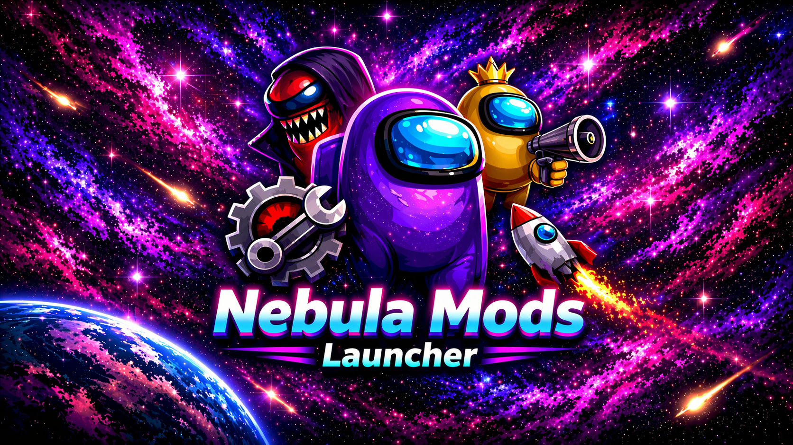

  

<h1 align="center">Nebula Mods Launcher 🌌</h1>

  An unofficial fan-made launcher for <b>Among Us</b> mods.

  
  
  

  
  
  
  

---

## 🚀 Release

Welcome to the release of **Nebula Mods Launcher**.

Nebula Mods Launcher is a convenient unofficial launcher designed to help users quickly find, review, and install Among Us mods from official **GitHub releases** in one place.

There is no longer any need to manually search for releases, extract archives, or figure out which files are compatible with your version of the game.  
The launcher provides a catalog of mods, latest versions, release status, author, source, and license information, and also helps users choose the correct assets for installation.

It supports installation of both **archived mods** and **DLL-based mods through BepInEx**.  
The launcher also remembers your game folder, making the installation process much simpler and more convenient.

## ✨ Features

- Browse supported Among Us mods in one catalog
- View the latest available releases
- Check mod author, source, and license information
- Install mods from official public GitHub releases
- Support both archive-based mods and DLL-based BepInEx mods
- Automatically remember the selected game folder
- Help identify the correct release assets for installation
- Simplify the mod installation workflow for users

## 📦 Available Mods

- Town of Host: Enhanced
- Endless Host Roles
- Project Lotus
- Super New Roles
- Town of Next: Edited
- The Other Us Edited
- Stellar Roles
- Among Us Revamped
- Among Us Revamped Enhanced
- Launchpad Reloaded
- BetterAmongUs
- BetterPolus
- PropHunt
- Main Menu Enhanced
- Emotes Mod
- Emojis in the Mogus Chat
- InvisiCrewmate
- NewMod
- Hydra
- HostGuard
- AUSummary
- TOU Mira Legacy
- Pokeball Mod
- MalumMenu
- AUnlocker
- TechTech's Sound Mod
- Airlock Client

## ⚙️ Installation

1. Download the latest release of **Nebula Mods Launcher**
2. Extract the launcher files to any folder
3. Run the launcher
4. Select your **Among Us** game folder
5. Choose a mod from the catalog
6. Review the mod information and available assets
7. Install the selected mod

## 🖥️ Requirements

- A legitimate copy of **Among Us**
- Windows operating system
- Internet connection for loading release information and downloading mod files
- **BepInEx** for DLL-based mods, when required by the selected mod

## 🔍 How It Works

Nebula Mods Launcher helps users access publicly available mod releases from their original sources.

Depending on the selected mod, the launcher can:
- download archive releases
- install DLL-based mods
- show source and release information
- help users pick the correct file for their setup

The launcher is designed to make installation easier, but compatibility and functionality still depend on the original mod release.

## 📝 Notes

- Not all mods are compatible with each other
- Some mods may only support specific game versions
- Some mods may require additional setup steps outside the launcher
- Availability depends on the original public source remaining online
- Mod authors retain ownership of their own releases and materials

## 🛠️ Planned Features

- Improved compatibility checks
- Better release asset detection
- More detailed mod information pages
- Expanded mod catalog
- Additional installation quality-of-life improvements
- Improved error handling and status feedback

## 💬 Support

If you find a bug, have a suggestion, or want to report an issue, please open an issue in this repository.

## 🤝 Credits

- **Among Us** by **Innersloth LLC**
- Third-party mods by their respective authors
- Nebula Mods Launcher as an unofficial fan-made project

## ⚠️ Important Notice

This launcher is intended to help users access third-party mods from their original public sources when available.  
It does **not** include, distribute, or replace the base game files of **Among Us**.

Users are responsible for reviewing the source, author, and license information of any mod they choose to install.

## 📄 Disclaimer

This launcher is an unofficial fan-made tool intended to help users access and install Among Us mods from official public repositories or release pages.

This launcher is not affiliated with Among Us or Innersloth LLC, and the content contained therein is not endorsed or otherwise sponsored by Innersloth LLC. Portions of the materials contained herein are property of Innersloth LLC. © Innersloth LLC.

This launcher is not affiliated with, endorsed by, or sponsored by the authors of any third-party mods featured in it, unless explicitly stated otherwise.

Third-party mods remain the property of their respective authors. This launcher does not claim ownership of any third-party content and does not rebrand such mods as its own.

When available, the launcher downloads mod files directly from the official public repositories or release pages provided by the original mod authors.

All mod names, logos, trademarks, and visual identities belong to their respective owners.

This project does not include, distribute, or replace the base game files of Among Us.

## ⚖️ Legal

If you are a copyright or trademark owner and believe any referenced content should be removed or adjusted, please contact the project maintainer or open an issue for review.
